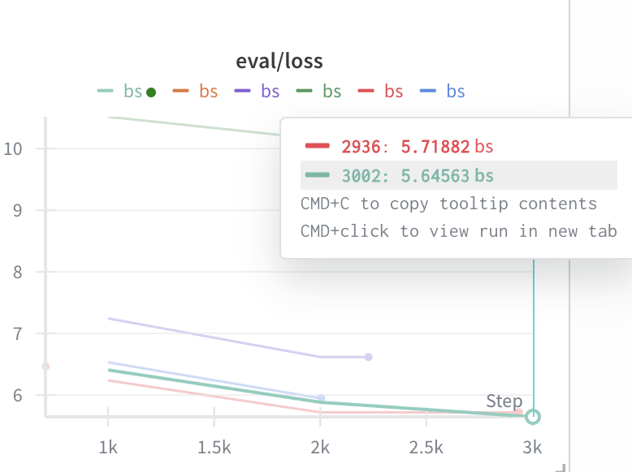
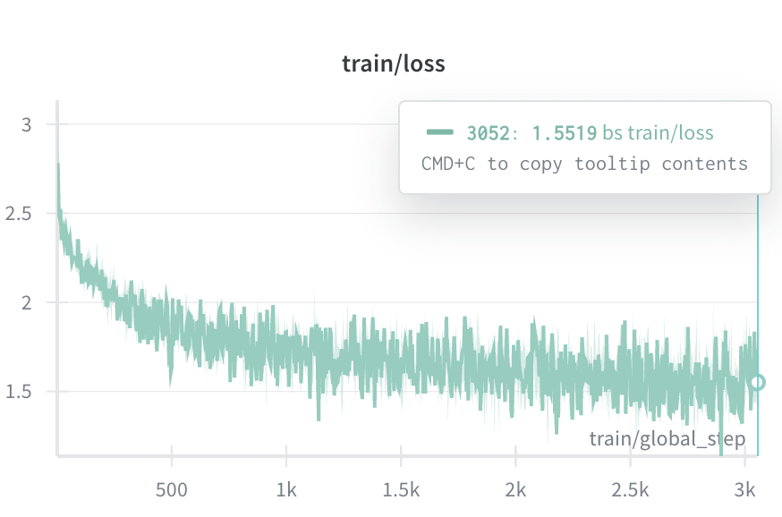
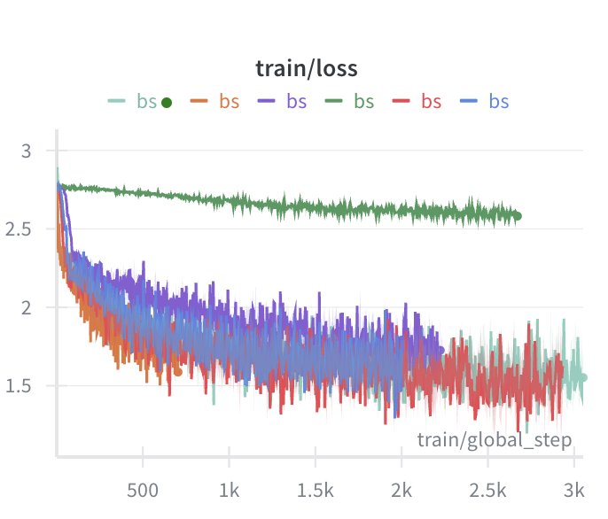

# ДЗ LLM Pretraining

## Описание

Проект реализует обучение и перебор гиперпараметров для обучения языковой модели GPT-2. Включает скрипты для обучения и инференса модели.

## Гиперпараметры

С помощью библиотеки optuna был произведен перебор следующих гиперпараметров:
- per_device_train_batch_size, [2, 4, 8, 16]
- learning_rate, 1e-6, 1e-3 (log=True)
- learning_rate_scheduler, ['linear', 'cosine', 'constant']
- optim, ['adamw_torch', 'adamw_torch_fused', 'adamw_bnb_8bit']
- dtype, ['float16', 'bfloat16', 'float32']

Для экономии времени эксперимента и ресурсов Авито всего было перебрано около 10 комбинаций. Лучший результат показала попытка со следующими гиперпараметрами:
- per_device_train_batch_size = 8
- learning_rate = 8.7е-4
- learning_rate_scheduler = "constant"
- optim = "adamw_torch_fused"
- dtype = "bfloat16"

Фактически делать какие-то выводы насчет оптимальных конфигураций не имеет смысла, так как для этого нужно либо гораздо больше экспериментов, либо сузить пространство исследуемых гиперпараметров.

Лучший eval_loss составил 5.64.

<center>

</center>

<center>

</center>

<center>

</center>

## Пример генерации:
Prompt:
```txt
На Авито вы можете недорого купить или выгодно продать 
```

Answer:
```txt
в качестве для своей жизни.

История 
Клуб был закрыт в составе сборной и не была принято решение в беге. В сезоне 2009 года он стал чемпионом мира в сезоне 2022 года, а в составе команды против сборной. В 2007 году он сыграл в двух команды со счётом 6:0.

В 2017 году был назначен на должность дистанции 20 лет, но в Кубке Европы в поединке. В матче стал чемпионом мира в сборной
```